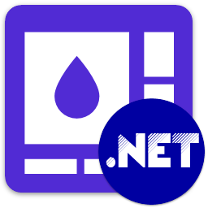

<div id="top"></div>

<!-- PROJECT INFO -->
<br />
<div align="center">
  <a href="https://github.com/sandre58/MyNetUi">
    
  </a>

<h1 align="center">My .NET UI</h1>

[![Downloads][downloads-shield]][downloads-url]
[![Forks][forks-shield]][forks-url]
[![Stargazers][stars-shield]][stars-url]
[![Issues][issues-shield]][issues-url]
[![MIT License][license-shield]][license-url]

  <p align="center">
    <br />
    This library is a comprehensive class library designed to simplify the implementation of common GUI functionalities in .NET applications. This library provides developers with a set of classes and utilities for integrating features such as notifications, MessageBox, navigation, toaster notifications, and theme management into graphical user interfaces.
    <br />
    Supporting only .NET 8.0
  </p>

[![Language][language-shield]][language-url]
[![Framework][framework-shield]][framework-url]
[![Version][version-shield]][version-url]
[![Build][build-shield]][build-url]

</div>

## Getting Started

To start using My .NET UI in your project, follow these steps:

1. Install the library via NuGet Package Manager:
   ```bash
   dotnet add package MyNet.UI

## What's included ?

### Notification System

- **Real-time Notifications**: Display real-time notifications to users to provide feedback or alert them about important events or updates.

- **Customizable Appearance**: Customize the appearance and behavior of notifications, including position, duration, animation, and styling options.

### MessageBox Integration

- **Dialog Boxes**: Implement standard dialog boxes, such as message boxes, confirmation dialogs, and input dialogs, to interact with users and gather input or confirmation.

- **Dialog Customization**: Customize dialog boxes with custom titles, messages, buttons, and iconography to match the application's branding or style.

### Navigation Framework

- **Navigation Management**: Manage navigation between different views or pages within the application to create seamless user experiences.

- **Navigation History**: Maintain a navigation history stack to support backward and forward navigation and facilitate navigation control.

### Toaster Notifications

- **Toast Notifications**: Display non-intrusive toast notifications to inform users about system events, updates, or messages.

- **Interactive Toasts**: Implement interactive toast notifications with action buttons or links to allow users to take immediate actions.

### Theme Management

- **Dynamic Theming**: Support dynamic theming and styling of the application interface to enable light/dark mode, color customization, or theme switching.

- **Theme Persistence**: Persist user-selected themes or preferences across application sessions to provide consistent user experiences.

## License

Copyright © Stéphane ANDRE.

My .NET UI is provided as-is under the MIT license. For more information see [LICENSE](./LICENSE).

<!-- MARKDOWN LINKS & IMAGES -->
<!-- https://www.markdownguide.org/basic-syntax/#reference-style-links -->
[language-shield]: https://img.shields.io/github/languages/top/sandre58/MyNetUi
[language-url]: https://github.com/sandre58/MyNetUi
[forks-shield]: https://img.shields.io/github/forks/sandre58/MyNetUi?style=for-the-badge
[forks-url]: https://github.com/sandre58/MyNetUi/network/members
[stars-shield]: https://img.shields.io/github/stars/sandre58/MyNetUi?style=for-the-badge
[stars-url]: https://github.com/sandre58/MyNetUi/stargazers
[issues-shield]: https://img.shields.io/github/issues/sandre58/MyNetUi?style=for-the-badge
[issues-url]: https://github.com/sandre58/MyNetUi/issues
[license-shield]: https://img.shields.io/github/license/sandre58/MyNetUi?style=for-the-badge
[license-url]: https://github.com/sandre58/MyNetUi/blob/main/LICENSE
[build-shield]: https://img.shields.io/github/actions/workflow/status/sandre58/MyNetUi/ci.yml?logo=github&label=CI
[build-url]: https://github.com/sandre58/MyNetUi/actions
[downloads-shield]: https://img.shields.io/github/downloads/sandre58/MyNetUi/total?style=for-the-badge
[downloads-url]: https://github.com/sandre58/MyNetUi/releases
[framework-shield]: https://img.shields.io/badge/.NET-8.0-purple
[framework-url]: https://github.com/sandre58/MyNetUi/tree/main/src/MyNet.UI
[version-shield]: https://img.shields.io/nuget/v/MyNet.UI
[version-url]: https://www.nuget.org/packages/MyNet.UI